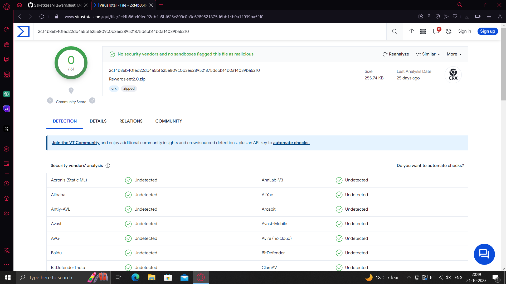

# Rewardsleet WebExtension

Download the Rewardsleet web extension from our official page. Upon first installation, you may be redirected to an advertisement page. Please be cautious and avoid downloading anything from the ads. We apologize for the inconvenience, but these ads help support us. Thank you!

## Installation Guide

We want to assure you that your privacy is 100% secure when using the Rewardsleet web extension. Although our extension was recently flagged as malware by the Microsoft store, this was a mistake. Our extension is completely safe to use.

To confirm our extension’s safety, we have conducted a scan that you can verify here: [VirusTotal Scanned Link](#). The scan confirms that our extension is secure and free from any malicious elements.

You can download the extension from our official GitHub page to ensure a safe and reliable source. Please avoid installing it from any other third-party platforms.

We apologize for any inconvenience caused and appreciate your understanding and continued support.

## Installation Steps

1. **Download the Extension:**
   - Click [here](https://github.com/Saketkesar/Rewardsleet/releases/download/v1.1.3/rewardsleet.v1.1.3.zip) to download the latest version of the extension (ZIP file).

2. **Extract the ZIP Archive:**
   - Locate the downloaded ZIP file in your Downloads folder.
   - Right-click on the ZIP file and select "Extract" or "Extract All" to unzip the contents.

3. **Install the Extension:**
   - Open your web browser.
   - Go to the browser's extension management page (usually found in the settings or extensions menu).
   - Enable "Developer Mode" or a similar option.

4. **Load the Extension:**
   - Click on "Load Unpacked" or a similar option.
   - Navigate to the folder where you extracted the extension files in step 2.
   - Select the folder and click "Open."

5. **Extension Installed:**
   - You should now see the Rewardsleet extension icon in your browser's toolbar.

Congratulations! The Rewardsleet WebExtension has been successfully installed on your browser. You can now start using it to earn Microsoft Rewards points.

Please note that this extension is safe and free of malicious content. If you encounter any issues or have questions, feel free to contact our support team.

## Contributors

A special thanks to Dipyan Roy for suggesting the maximum delay of 10-15 sec to avoid ID bans. Your input is greatly appreciated!

Enjoy using Rewardsleet!
