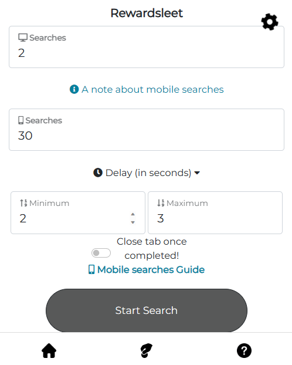

# Rewardsleet
Download Rewardsleet web extension from our official page
# RewardsLeet WebExtension - Installation Guide

Welcome to the installation guide for the new version of RewardsLeet WebExtension. This extension helps you easily grind Microsoft Rewards points.

## Installation Steps

1. **Download the Extension:**
   - Click [here](https://github.com/Saketkesar/Rewardsleet/releases/download/v1.1.1/Rewardsleet2.0.zip) to download the latest version of the extension (ZIP file).

2. **Extract the ZIP Archive:**
   - Locate the downloaded ZIP file in your Downloads folder.
   - Right-click on the ZIP file and select "Extract" or "Extract All" to unzip the contents.

3. **Install the Extension:**
   - Open your web browser.
   - Go to the browser's extension management page (usually found in the settings or extensions menu).
   - Enable "Developer Mode" or similar option.

4. **Load the Extension:**
   - Click on "Load Unpacked" or a similar option.
   - Navigate to the folder where you extracted the extension files in step 2.
   - Select the folder and click "Open."

5. **Extension Installed:**
   - You should now see the RewardsLeet extension icon in your browser's toolbar.

Congratulations! The RewardsLeet WebExtension has been successfully installed on your browser. You can now start using it to earn Microsoft Rewards points.

Please note that this extension is safe and free of malicious content. If you encounter any issues or have questions, feel free to contact our support team.

Enjoy using RewardsLeet!
